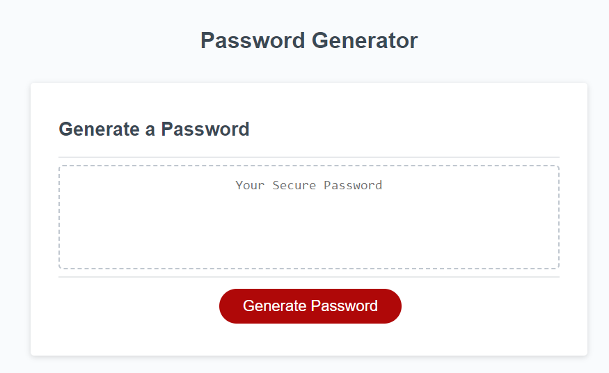
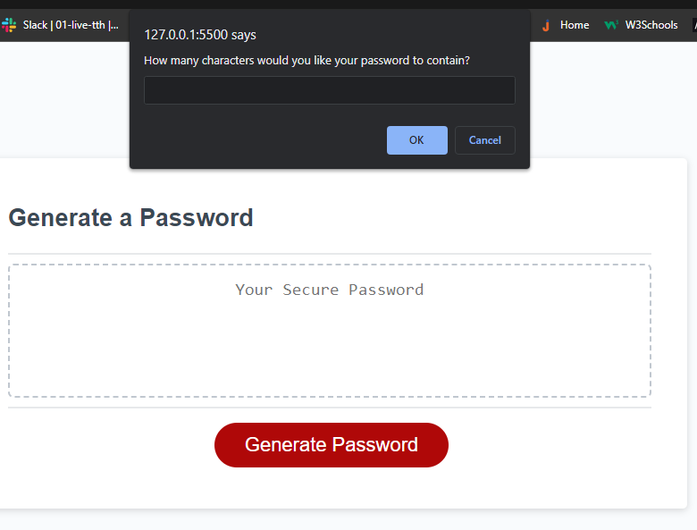
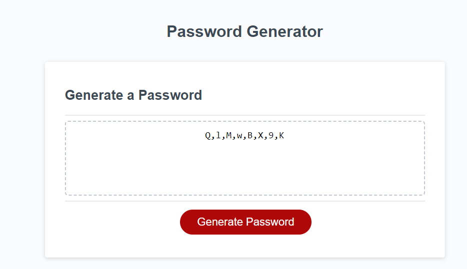

Password Generator Application

Description:
This application allows users to randomly generate unique passwords that meet certain criteria that provide greater security.  

Criterias include:
1) Password lenght of 8-126 characters.
2) Password may include UpperCase characters. 
3) Password may include Lowercase characters. 
4) Password may include special characters.
5) Password may include numeric characters.

